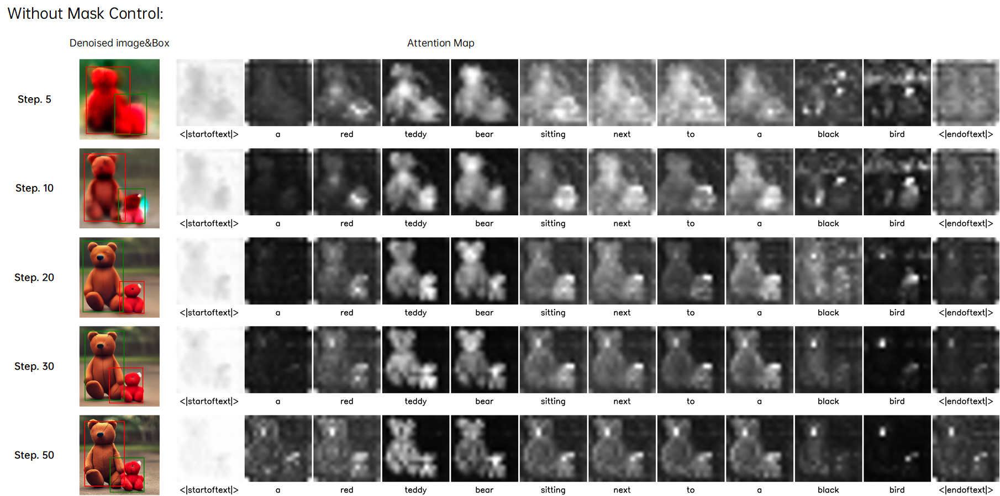
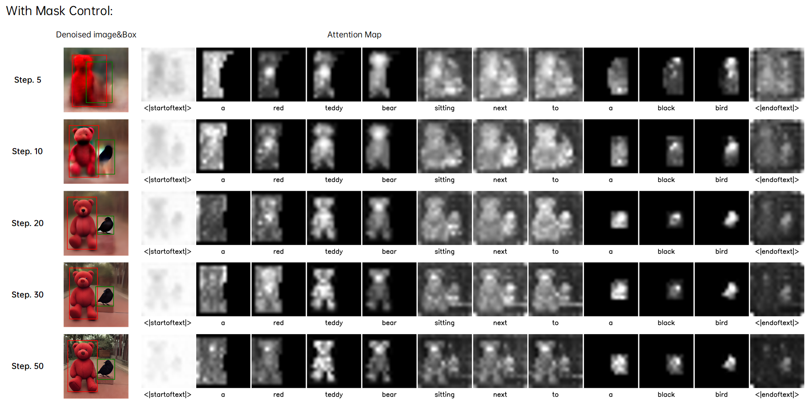
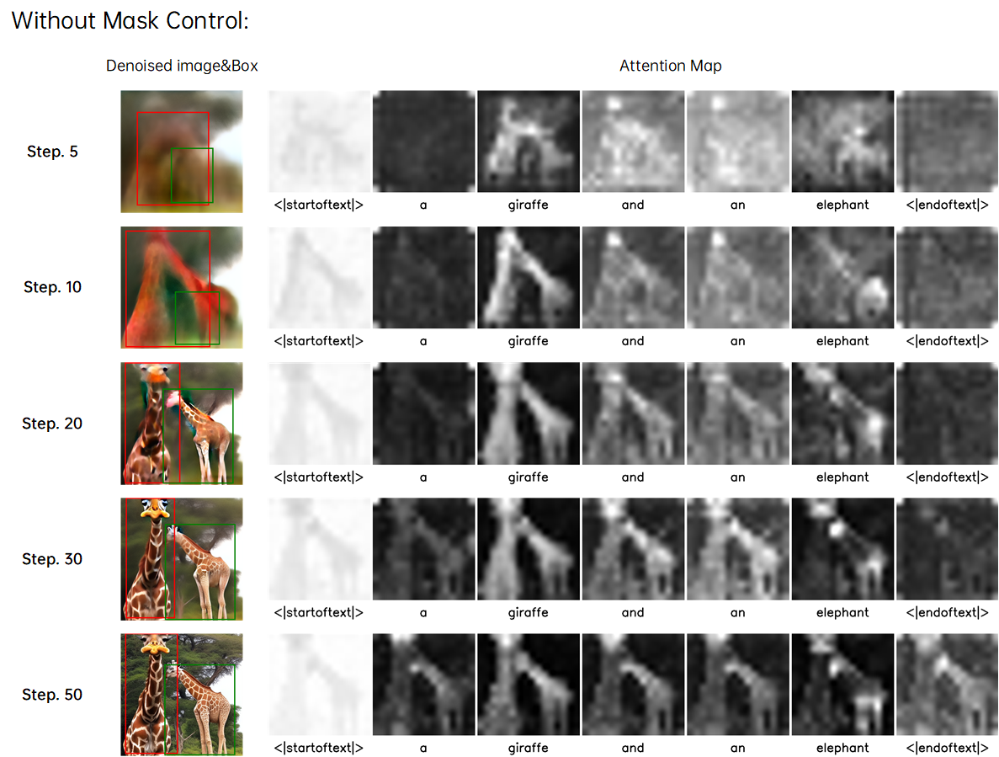
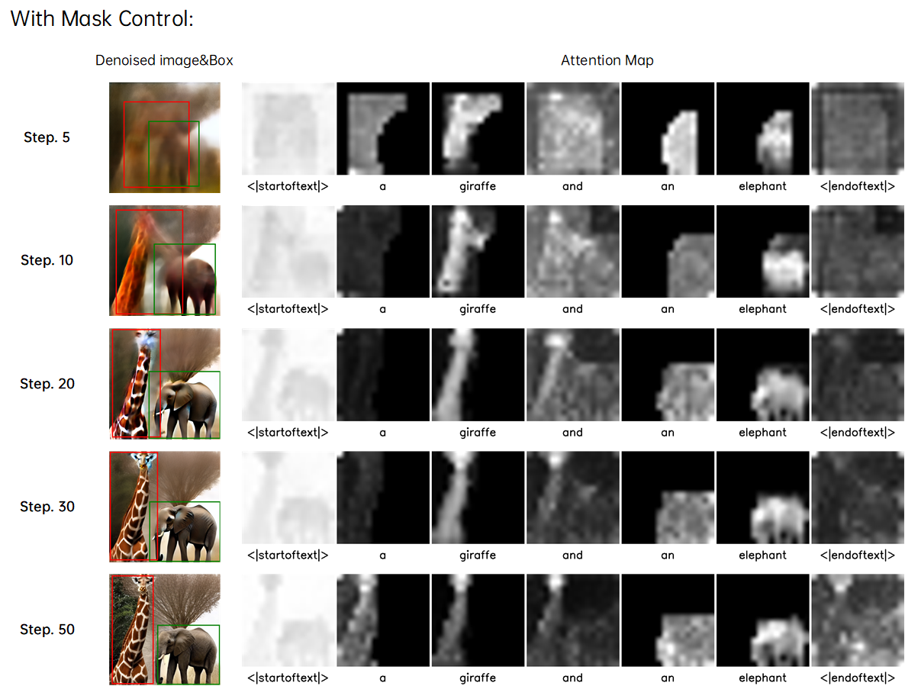
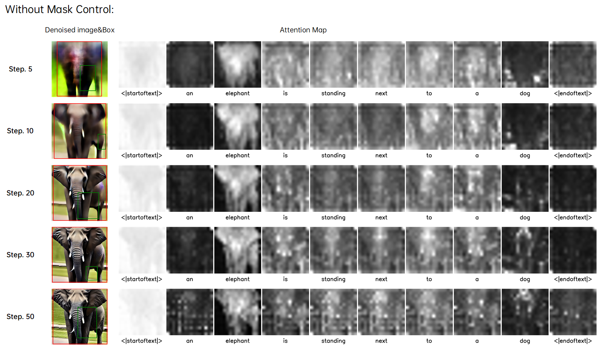
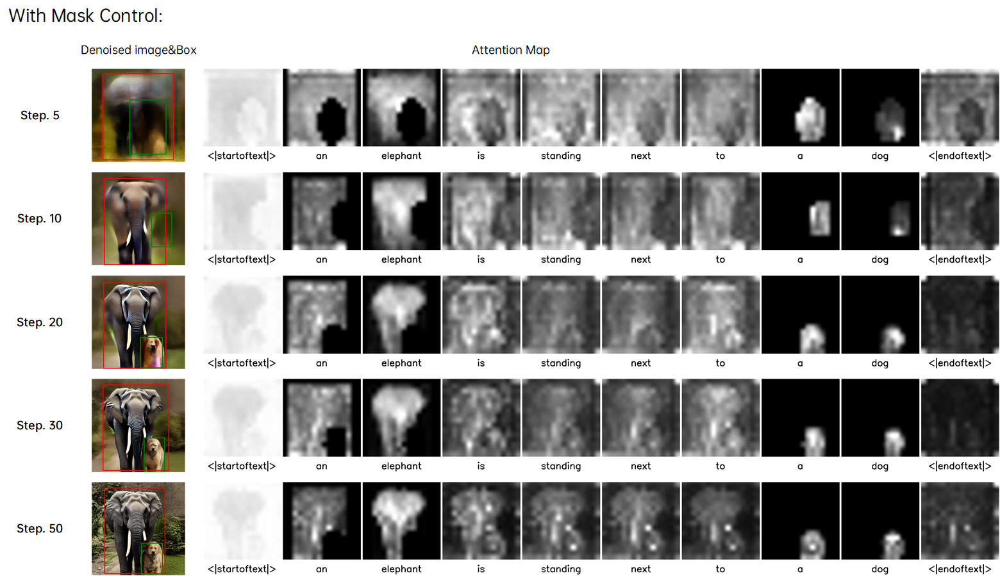

## 1. Results for Triple Entity Generation:
We provide a comparison of results for triple entity generation:

All results are consistent with Figure 4 in the paper, and the results of the three methods remain consistent with the random seeds.

## 2. Mask Control results visualization
We have made an additional supplement to Figure 3 in the paper, which includes the intermediate denoising results and the comparison of attention maps after adding Mask Control. (The original random seed for Figure 3 was lost and could not be reproduced, so we selected three new images for illustration)
### case 1

### case 2

### case 3

